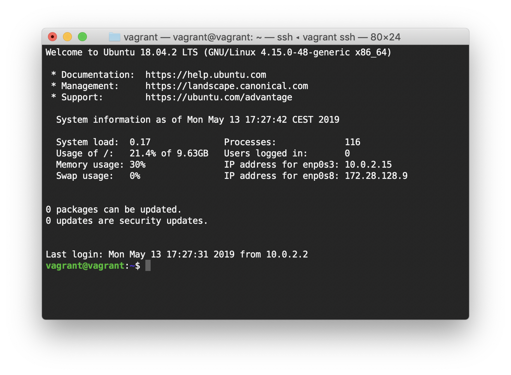

# Vagrant Setup
This repository contains a [Vagrantfile](https://vagrantup.com/) for a Ubuntu 16.04 VirtualBox host and [Ansible](http://ansible.com/) playbooks for a WordPress-ready LEMP development environment. The default `playbook.yml` installs the most recent versions of NGiNX, PHP-FPM and MariaDB. It also installs and configures [WP-CLI](https://wp-cli.org) to manage the virtual WordPress sites from the command line and [Composer](https://getcomposer.org) for PHP dependency management.



## Installed Components
- [Avahi](http://www.avahi.org) mDNS service discovery
- [MailHog](https://github.com/geerlingguy/ansible-role-mailhog) testing tool to capture SMTP traffic
- [Composer](http://getcomposer.org) dependency manager for PHP
- [hhighlighter](https://github.com/paoloantinori/hhighlighter) script for ack-grep
- [MariaDB](https://www.mariadb.org) database server
- [NGiNX](http://nginx.org) web and proxy server
- [PHP](http://php.net) & [FastCGI](http://php-fpm.org) Process Manager
- [WP-CLI](http://wp-cli.org) tools for WordPress

## Default Configuration
```yaml
# System wide settings for timezone, locale, etc.
init_timezone: 'Europe/Copenhagen'
init_locales:
  - 'en_US.UTF-8'
  - 'da_DK.UTF-8'

# Enable to ensure all packages are kept up to date
common_apt_upgrade: true
```

## Future work
* Create separate git repos for `vagrant` and `playbooks` to keep stuff portable.
* Enable support for [Let's Encrypt](https://letsencrypt.org) and automatic renewal of certificates.

#### References and Guidelines
* [DigitalOcean's Initial Server Setup](https://www.digitalocean.com/community/tutorials/initial-server-setup-with-ubuntu-16-04)
* [DigitalOcean's Additional Checklist ](https://www.digitalocean.com/community/tutorials/additional-recommended-steps-for-new-ubuntu-14-04-servers)
* [DigitalOcean's LEMP-setup Guide](https://www.digitalocean.com/community/tutorials/how-to-install-linux-nginx-mysql-php-lemp-stack-in-ubuntu-16-04)
* [DigitalOcean's guide to Let's Encrypt](https://www.digitalocean.com/community/tutorials/how-to-secure-nginx-with-let-s-encrypt-on-ubuntu-16-04)
